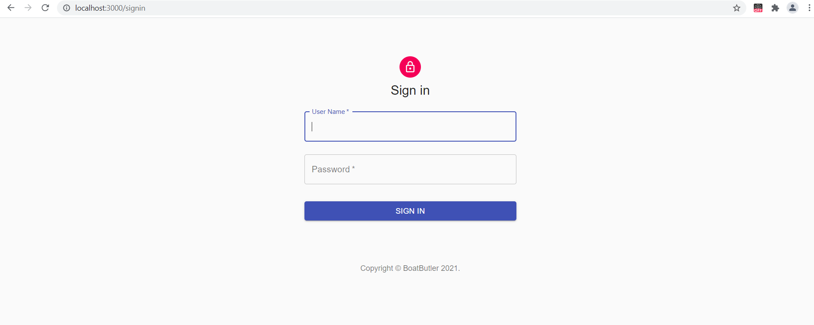
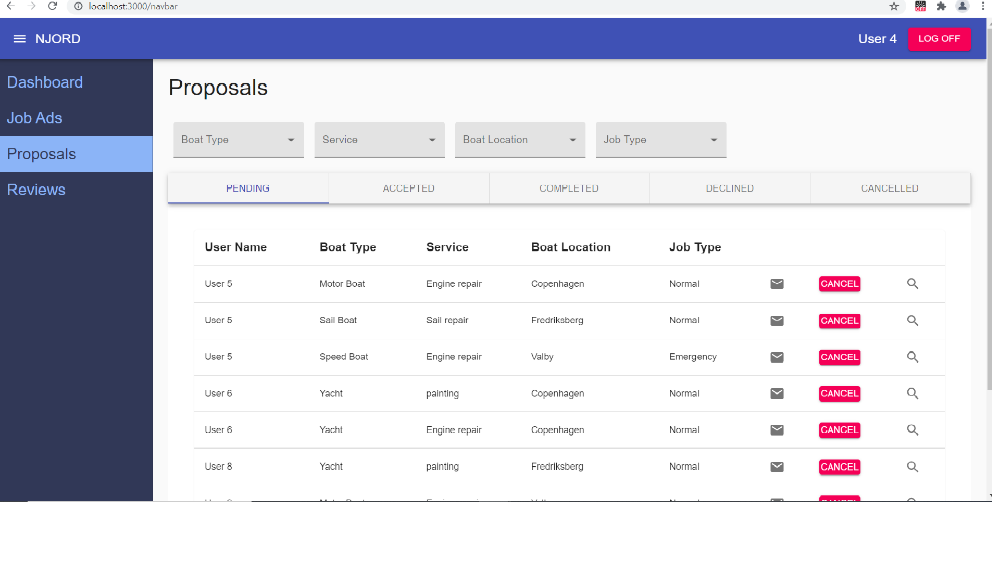

# BoatButler app (boat-butler-app)
##About
The frontend is implemented using *React* web framework. *Matrial-UI* is used for styling the app.
The backend is implemented using *Express*, *Node.js* and *Axios*.

##App Set Up
###How to initialise database
The app uses SQL database. A script `createdb.sql` can be found under `/server` folder. Running the script will create database named `proposalsdb` with required tables. This script also seeds database with dummy data for the app.

###Folder structure
The source code is divided into two folders. The code for frontend is under `/client` and code for backend is under `/server`. The node modules should be installed separately with `package.json` found under both these folders.

### How to connect the database
Create `.env` file under `/server` folder. An example is provided with `/server/.env.example`. Provide database connection password with parameter `DB_PASSWORD`.

###How to start the app
Frontend and backend development servers should be started individually from their respective roots `/client` and `/server`.
Run command `yarn start` to start frontend development server.
Run command `yarn devStart` to start backend development server.

###Sign-in to the app
Five users `User 1`, `User 2`, `User 3`, `User 4`, and `User 5` can sign-in. Password for all users is `password`.

##Features
####Sign-in page
Only users with role `company_user` can sign-in. The feature is implemented using react `useState` hook since the app has shallow component tree.

####Proposals
The landing page after sign-in displays proposals with pending status for the signed in user. User can navigate to proposals with other statuses in a tab-view.

####Select Proposal
The proposals can be filtered with the dropdowns above the proposal list. Multiple values can be selected for a single filter. Proposals filtered for all filters together. The filters can be de-selected by simply clicking on the dropdown menu items again.

####Cancel proposals with status as Pending
Proposals with status as pending can be cancelled by clicking on `Cancel` button. The data is updated in the database, and the cancelled proposal is displayed under `Cancelled` tab.

####Log off
User can log off using `LOG OFF` button in the top navigation bar.

##Future improvements
####Improved API security
API calls can be secured using JSON Web Tokens

####Implement sign-in using `useContext`
If the component tree grows deeper, sign in feature can be improved with react hook `useContext`

 

